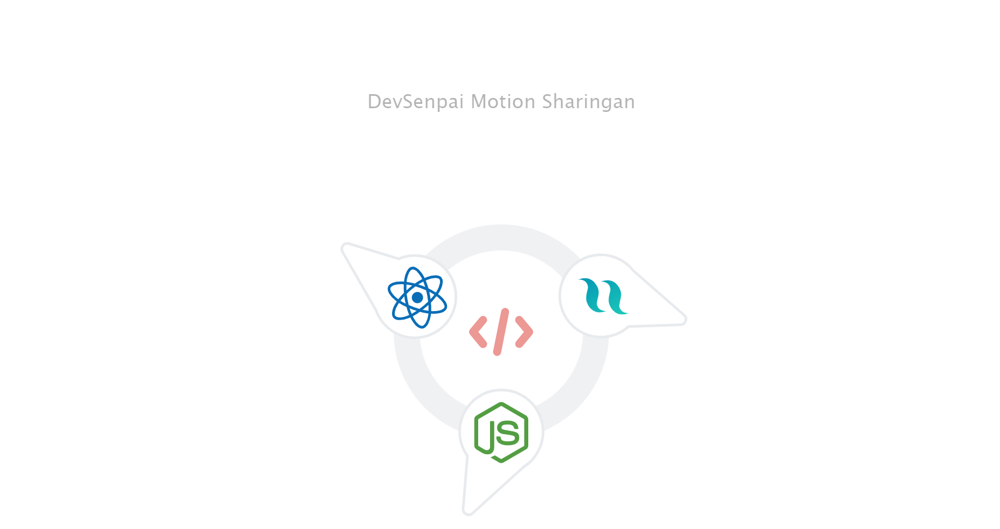

# DevSenpai Motion Sharingan

This is a motion design inspired by the sharingan from Naruto Series.

## Table of contents

- [Screenshot](#screenshot)
- [Links](#links)
- [Built with](#built-with)
- [What I learned](#what-i-learned)
- [Author](#author)

### Screenshot

### Links

- Live Site URL: [live site URL](https://devsenpai-motion-sharingan.netlify.app/)

### Built with

- JSX
- CSS custom properties
- Grid
- Mobile-first workflow
- React
- Styled-Components
- CSS animation

### What I learned

- I learnt how to create animation with using styled-components

## Author

- Website - [DevSenpai](https://www.your-site.com)
- Twitter - [@DevSenpai09](https://twitter.com/DevSenpai09)
- Facebook - [@DevSenpai09](https://web.facebook.com/devsenpaio09)
- Instagram - [@DevSenpai09](https://www.instagram.com/devsenpai09)
